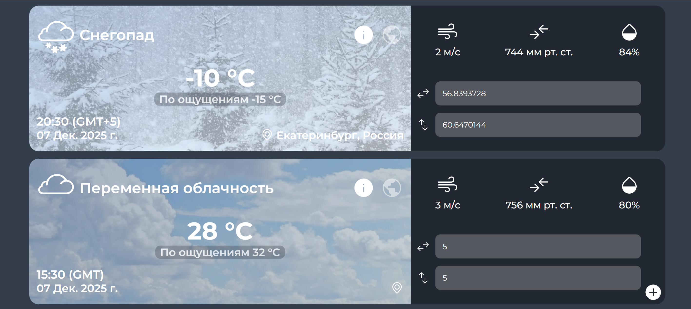

# Приложение для погоды WeatherApp

## Описание

WeatherApp — приложение для отображения актуальной погоды по геолокации или заданным координатам. Показывает не только температуру, но и полную метеоинформацию, в том числе карту местоположения для каждого виджета.

### Основные фичи

- **Работает полностью без сторонних библиотек и фреймворков** (чистый JavaScript ES6).
- **Валидация координат:** широта и долгота проверяются, поля с ошибкой подсвечиваются.
- **Использует современные подходы к асинхронности:** все данные получаются через fetch/async/await (OpenMeteo, Nominatim, загрузка шаблона).
- **Понятно структурирован:** отдельные модули для компонентов, утилит, API, валидации, констант.
- **Динамические карточки погоды:** можно добавлять неограниченно много погодных карточек — для каждой свои координаты, данные.
- **Интеграция с картой OSM**: отображает карту местоположения при вводе координат.
- **Улучшенный дизайн:** разные иконки и фоны под погодные условия — солнечно, дождь, снег, гроза, туман, и др.
- **Отображение данных:** температура, ощущаемая температура, влажность, давление, скорость ветра, название локации, дата и время время последнего обновления информации.
- **UI Максимально приближен к предоставленному макету Figma**, с рядными улучшениями для UX.

### Используемые API

- [OpenMeteo](https://open-meteo.com/) — прогноз погоды.
- [Nominatim OpenStreetMap](https://nominatim.openstreetmap.org/) — получение локации по координатам.
- [OpenStreetMap Embedded](https://www.openstreetmap.org/export/embed.html) — отображение карты.

### Особенности

- **Добавление новых карточек** — через "+" в любом виджете.
- **Ввод координат вручную** — лейблы "Широта" и "Долгота".
- **Каждый виджет живет отдельно** — своё состояние, карта, инпуты.

### Скриншоты интерфейса

[Макет Figma](https://www.figma.com/proto/mS4AXN175LVICkQ2cklxdt/%D0%9F%D0%BE%D0%B3%D0%BE%D0%B4%D0%B0?node-id=0-1&t=qJz6NjRDAsUxnVLB-1)

### Структура проекта

- `index.html` — главная точка входа
- `src/js` — компоненты, утилиты, api
- `sass` — исходные стили
- `assets` — изображения и прочие ресурсы
- `templates/weather.html` — шаблон карточки погоды

---

**Автор**: [Armontex](https://github.com/Armontex)

